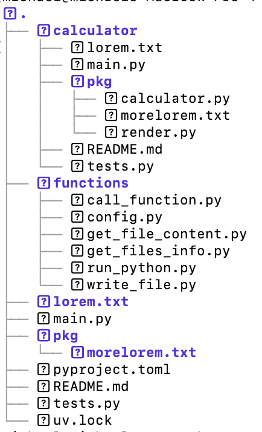

# py_ai_agent

py_ai_agent was a small python project that i used to learn about LLM's and how they can be used to interact with exsiting codebases. It currently ships with a simple calculator tool which i have purposefully broken the plus opperator precedence on. 

- Built as part of my Boot.dev / personal learning journey. Feedback and PRs welcome!

## Features
- Agent loop that routes user input to tools
- Basic Tests to check my work
- A python caclulator (broken) as a demonstation
- uv support to make the 

## Structure 

## Requirements 

- Python 3.11 + 
- MacOS / Linux / WSL (I have only tested this on MacOS)

- Google Gemini API Key (https://ai.google.dev/gemini-api/docs/api-key) - this should go in a .env file in the root of the project directory. 

## Clone 
- git clone https://github.com/michaellittle92/py_ai_agent.git
- cd py_ai_agent

## Create the environment 
- uv sync
- uv run python -V 

## Run it
- Confirm the caluclator is broken with something like uv run calculator/main.py "5 + 14 * 2"

-  uv run main.py "fix the bug: 5 + 14 * 2 shouldn't be 38"               
